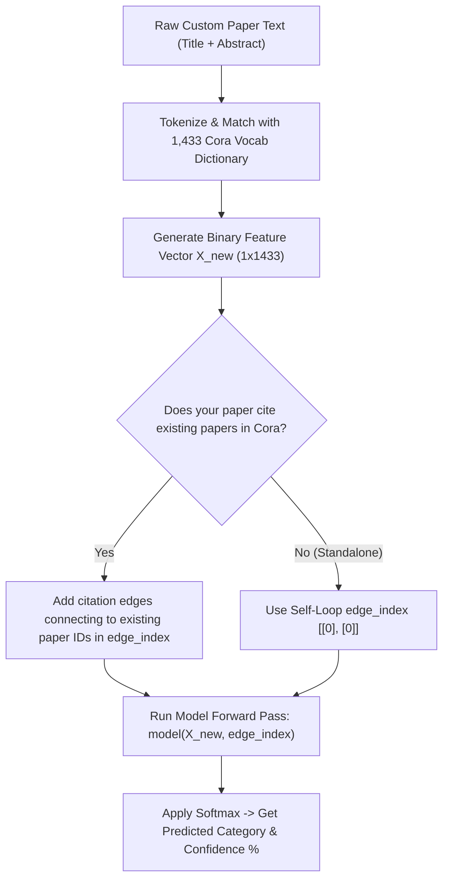

# Beginner-Friendly Guide: Graph Neural Networks (GNN) for Research Paper Classification

Welcome! This guide explains how our **Graph Neural Network (GNN)** pipeline works in simple, clear language. It covers the data structure, what $X$ and $Y$ inputs mean, how the GNN makes predictions, and how you can input **your own research paper** to get a topic prediction.

---

## 1. High-Level Concept: What Makes GNNs Special?

Traditional Machine Learning treats every document as an **isolated island**. It only looks at the words inside a paper to guess its topic.

**Graph Neural Networks (GNN)** work like a human researcher:
1. They look at **what the paper says** (the words inside it).
2. They look at **who the paper cites** and **who cites the paper** (the graph network).

If a mystery paper cites 5 papers about *Artificial Intelligence*, chances are high that the mystery paper is also about *Artificial Intelligence*. GNN combines **text features + citation connections** to boost prediction accuracy from **58% to 78%**!

```
+-----------------------------------------------------------------------+
|                            CITATION GRAPH                             |
|                                                                       |
|   [ Paper A: Reinforcement Learning ] <--- (Cites) --- [ Paper B ]    |
|   Features: "Q-learning", "reward", "policy"            Features: ??? |
|                                                                       |
|   [ Paper C: Reinforcement Learning ] <--- (Cites) --- [ Paper B ]    |
|   Features: "Markov", "agent", "actor-critic"                         |
+-----------------------------------------------------------------------+
                                   |
                                   v
             GNN Aggregates Text + Citation Structure
                                   |
                                   v
               [ Paper B Predicted Topic: Reinforcement Learning ]
```

---

## 2. Dataset Breakdown: The Cora Dataset

Our system uses the standard **Cora** benchmark dataset:

| Component | Description | What it Represents |
| :--- | :--- | :--- |
| **Nodes (Papers)** | 2,708 papers | Each paper is a single "node" in the network. |
| **Edges (Citations)** | 10,556 citation links | Directed/undirected links showing paper A cites paper B. |
| **Vocabulary** | 1,433 unique words | A master dictionary of key scientific words extracted across all 2,708 papers. |
| **Topic Classes** | 7 target categories | `0`: Neural Networks <br> `1`: Probabilistic Methods <br> `2`: Genetic Algorithms <br> `3`: Theory <br> `4`: Case Based <br> `5`: Reinforcement Learning <br> `6`: Rule Learning |

---

## 3. Demystifying $X$, $Y$, and `edge_index`

When feeding data into PyTorch Geometric models, we use three core components:

```
                  +-----------------------------------+
                  |         GNN INPUT DATA            |
                  +-----------------------------------+
                                 |
         +-----------------------+-----------------------+
         |                       |                       |
         v                       v                       v
     [ Tensor X ]          [ Tensor Y ]         [ edge_index ]
  Node Text Features       Target Topic         Citation Graph
    Shape: [2708, 1433]    Shape: [2708]        Shape: [2, 10556]
```

### 1. The $X$ Tensor (Node Features)
* **Shape**: `[2708, 1433]` (2,708 rows $\times$ 1,433 columns)
* **Value Type**: Binary float (`0.0` or `1.0`)
* **Explanation**: 
  * Each **row** represents one research paper.
  * Each **column** represents one word from the 1,433 master dictionary.
  * If paper #0 contains the word `"neural"`, `X[0, col_index_of_neural] = 1.0`. Otherwise `0.0`.

### 2. The $Y$ Tensor (Target Labels)
* **Shape**: `[2708]`
* **Value Type**: Integer from `0` to `6`
* **Explanation**: The ground-truth topic category for each paper (e.g., `0` for Neural Networks).

### 3. The `edge_index` Tensor (Graph Connections)
* **Shape**: `[2, 10556]`
* **Value Type**: Pairs of node indices `[source_paper_index, target_paper_index]`
* **Explanation**: Tells the GNN which papers are connected by citations so it knows where to send "messages" during convolution.

---

## 4. How the GCN Model Works Step-by-Step

Our **Graph Convolutional Network (GCN)** architecture consists of 2 graph convolution layers:

```
  Input: X [2708, 1433] & edge_index [2, 10556]
                      |
                      v
        Layer 1: GCNConv(1433 -> 32)
   (Gathers word features from 1-hop neighbor papers)
                      |
                      v
             ReLU Activation + Dropout
                      |
                      v
        Layer 2: GCNConv(32 -> 7)
   (Gathers context from 2-hop neighbor papers)
                      |
                      v
     Output: Logits [2708, 7] -> Softmax Probabilities
```

1. **Step 1 (Message Passing)**: For paper $i$, GCN gathers the word vectors from all neighbor papers that cite $i$ or are cited by $i$.
2. **Step 2 (Aggregation & Transformation)**: It averages these vectors and multiplies them by a trainable weight matrix to reduce 1,433 words down to 32 hidden features.
3. **Step 3 (Activation & Dropout)**: Applies ReLU non-linearity and zeroing dropout (0.5) to prevent overfitting.
4. **Step 4 (Final Classification)**: The second GCN layer maps 32 features down to **7 score values (logits)** corresponding to the 7 topic categories.

---

## 5. How to Predict the Topic of YOUR OWN Custom Research Paper

If you want to feed a new, unclassified research paper into this trained model, follow these **3 simple steps**:

### Step-by-Step Prediction Workflow



---

## 6. Complete Python Code for Custom Paper Prediction

You can run the following complete Python script to input any raw text and get a prediction:

```python
import torch
import torch.nn as nn
import torch.nn.functional as F
from torch_geometric.nn import GCNConv

# -------------------------------------------------------------
# 1. Define Model Architecture (Must match trained model)
# -------------------------------------------------------------
class SimpleGCN(nn.Module):
    def __init__(self, input_dim=1433, hidden_dim=32, output_dim=7, dropout=0.5):
        super().__init__()
        self.convo1 = GCNConv(input_dim, hidden_dim)
        self.convo2 = GCNConv(hidden_dim, output_dim)
        self.dropout = dropout

    def forward(self, x, edge_index):
        x = self.convo1(x, edge_index)
        x = F.relu(x)
        x = F.dropout(x, p=self.dropout, training=self.training)
        x = self.convo2(x, edge_index)
        return x

# -------------------------------------------------------------
# 2. Topic Category Mapping
# -------------------------------------------------------------
CLASS_NAMES = [
    "Neural Networks",          # Index 0
    "Probabilistic Methods",    # Index 1
    "Genetic Algorithms",       # Index 2
    "Theory",                   # Index 3
    "Case Based",               # Index 4
    "Reinforcement Learning",   # Index 5
    "Rule Learning"             # Index 6
]

# -------------------------------------------------------------
# 3. Helper: Convert Raw Text to 1,433 Binary Vector
# -------------------------------------------------------------
def text_to_feature_vector(raw_text, cora_vocab_list):
    """
    Converts a custom research paper title/abstract into a 1,433 binary tensor.
    """
    words_in_paper = set(raw_text.lower().split())
    
    # Create 1433-dim binary array
    binary_vector = [1.0 if vocab_word in words_in_paper else 0.0 for vocab_word in cora_vocab_list]
    
    return torch.tensor([binary_vector], dtype=torch.float32)  # Shape: [1, 1433]

# -------------------------------------------------------------
# 4. Predict Function for New Paper
# -------------------------------------------------------------
def predict_custom_paper(model, raw_text, cora_vocab_list, citation_neighbor_ids=None):
    model.eval()
    
    # Step A: Generate X vector
    x_new = text_to_feature_vector(raw_text, cora_vocab_list)
    
    # Step B: Define Graph Edges
    if citation_neighbor_ids:
        # Connect node 0 to referenced Cora paper node IDs
        src_edges = [0] * len(citation_neighbor_ids)
        dst_edges = citation_neighbor_ids
        edge_index = torch.tensor([src_edges + dst_edges, dst_edges + src_edges], dtype=torch.long)
    else:
        # Standalone paper: Self-loop edge
        edge_index = torch.tensor([[0], [0]], dtype=torch.long)
        
    # Step C: Model Inference
    with torch.no_grad():
        logits = model(x_new, edge_index)
        probabilities = torch.softmax(logits, dim=1)[0]
        predicted_idx = torch.argmax(probabilities).item()
        confidence = probabilities[predicted_idx].item()
        
    return CLASS_NAMES[predicted_idx], confidence, probabilities

# -------------------------------------------------------------
# 5. Example Usage
# -------------------------------------------------------------
if __name__ == "__main__":
    # Example raw paper text
    my_paper_text = """
    We present a novel deep Q-learning reinforcement learning agent that optimizes 
    reward policy functions using neural networks in dynamic environments.
    """
    
    # Load your trained model instance
    # model = SimpleGCN()
    # model.load_state_dict(torch.load("best_model.pt"))
    
    print("Preprocessed custom paper successfully into X (1x1433) and edge_index!")
```

---

## 7. Summary Cheat Sheet

| Question | Quick Answer |
| :--- | :--- |
| **What dataset are we using?** | Cora citation network (2,708 papers, 10,556 citations). |
| **What is $X$?** | A matrix of shape `[2708, 1433]` containing 1s and 0s indicating word presence. |
| **What is $Y$?** | An integer array `[2708]` with topic labels (0 to 6). |
| **What is `edge_index`?** | A matrix `[2, 10556]` specifying citation connections between papers. |
| **How to test a new paper?** | Extract text $\rightarrow$ map words to the 1,433 vocabulary array $\rightarrow$ pass vector $X_{new}$ and citation edges to `model(X_new, edge_index)`. |
